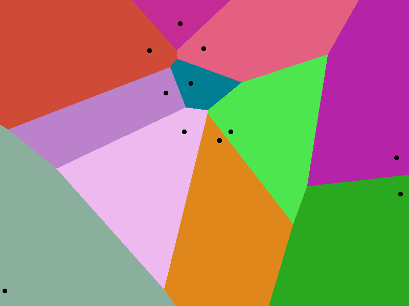

# Voronoi Kumir
Программа для рендера [диаграммы Вороного](https://ru.wikipedia.org/wiki/%D0%94%D0%B8%D0%B0%D0%B3%D1%80%D0%B0%D0%BC%D0%BC%D0%B0_%D0%92%D0%BE%D1%80%D0%BE%D0%BD%D0%BE%D0%B3%D0%BE)

## Как запустить?
1. Скачать и установить КуМир 2 [тут](https://www.niisi.ru/kumir/dl.htm)
2. Скачать и распаковать репозиторий
3. Запустить КуМир-Про (тестировалось в нем, работа в других версиях не гарантируется)
4. Нажать "Загрузить программу..."
5. Выбрать файл Voronoi.kum
6. Настроить (при необходимости)
7. Запустить (кнопка "плей" сверху)

## Как настроить?
В файле Voronoi.kum есть разделы, отмеченные `||`

В разделе "Настройки" находятся все доступные настройки. **!!! НЕЛЬЗЯ ТРОГАТЬ ЗНАЧЕНИЯ В ДРУГИХ РАЗДЕЛАХ !!!**

### Типы данных

| Тип  | Описание                  |
| ---- | ------------------------- |
| цел  | Целое число               |
| цвет | Цвет                      |

